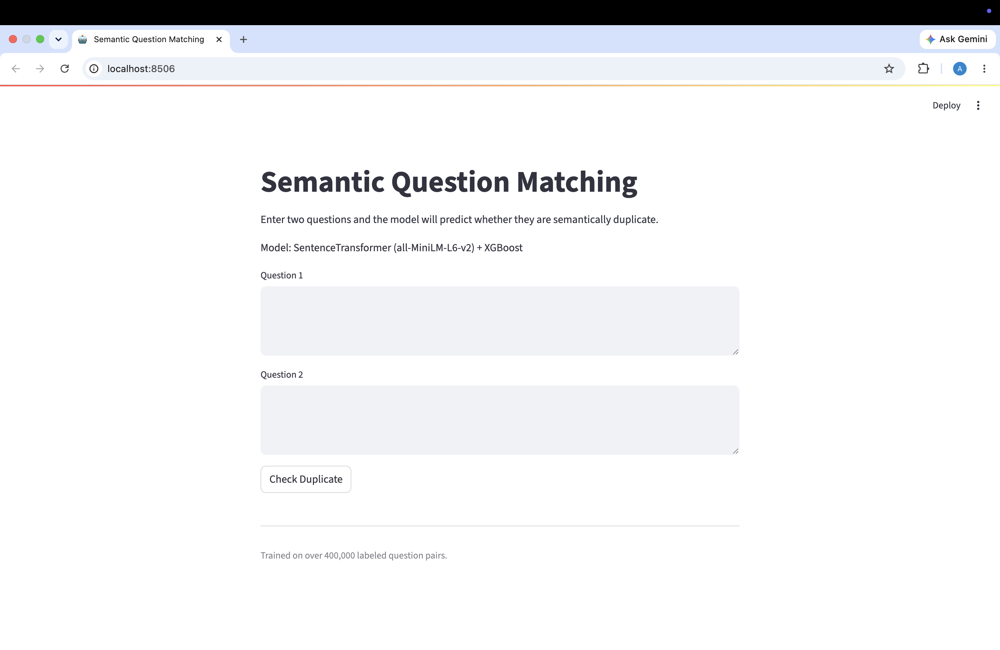

# Quora Duplicate Question Detection


Binary classification task: given two questions from Quora, predict whether they're asking the same thing.

```
Q1: "How can I learn Python?"
Q2: "What is the best way to study Python programming?"
→ Duplicate
```

The hard part isn't the model — it's that two questions can mean the same thing without sharing many words, and two questions can share most words while meaning entirely different things ("capital of India" vs "business capital of India"). Getting that right is what this project explores.

---

## Live Demo

🔗 **Live Application:** https://ayushigupta2132-semantic-duplicate-question-detectio-app-zoc0mk.streamlit.app/

The final model is deployed as an interactive Streamlit application. Users can enter any two questions and receive a duplicate probability score generated by the SentenceTransformer + XGBoost pipeline.

---

## Application Preview

### Home Page



### Prediction Example


---

## Results

| Approach                                         | Accuracy   | F1         |
| ------------------------------------------------ | ---------- | ---------- |
| CountVectorizer + XGBoost (baseline)             | ~79%       | —          |
| Handcrafted features + CountVectorizer + XGBoost | 80.99%     | 73.92%     |
| SentenceTransformer embeddings + XGBoost         | **86.59%** | **82.15%** |

The jump from ~79% to 86.59% came in two stages: feature engineering got about half of it, and switching to sentence embeddings got the other half.The final transformer-based model was deployed as an interactive Streamlit application for real-time duplicate question prediction.

---

## Repository

├── app.py # Streamlit application
├── model.pkl # Trained XGBoost model
├── quora_eda.ipynb # EDA and baseline experiments
├── quora_duplicate_detection.ipynb # Complete training pipeline
├── requirements.txt
├── README.md
└── images/

---

## Dataset

404,290 question pairs from the [Quora Question Pairs](https://www.kaggle.com/c/quora-question-pairs) dataset. Target column is `is_duplicate` (0 or 1). Class split is roughly 63/37 — not severe enough to require resampling, but enough that accuracy alone is misleading (a model that always predicts "not duplicate" gets 63%).

---

## EDA

Before writing any features, I spent time understanding what the data actually looks like.

A few things that influenced the modeling approach:

**Class distribution**: 63% non-duplicate, 37% duplicate. I used stratified splits throughout and tracked F1 alongside accuracy.

**Question repetition**: Some questions appear hundreds of times across different pairs. The log-scale histogram of question frequency has a very long tail. This told me the model needs to understand _what a question is asking_, not just recognize specific questions it's seen before.

**Early baseline** (BoW only, no engineered features):

- `CountVectorizer(max_features=3000)` + `RandomForest` → ~78%
- `TF-IDF(max_features=5000)` + `XGBoost` → ~79%

These baselines were useful. They showed that lexical overlap alone gets you to ~79% and then stalls. Anything beyond that needs a different kind of signal.

---

## Preprocessing

Before feature engineering, I built a custom preprocessing function to normalize the text. The main steps:

- Lowercase everything
- Expand contractions (`isn't` → `is not`) — important because token overlap features would miss the match otherwise
- Normalize currency/percentage symbols (`$1000` → `dollar 1000`, `50%` → `50 percent`) so they tokenize as meaningful words
- Compact large numbers (`1,000,000` → `1m`) to reduce sparsity
- Strip HTML tags — Quora questions sometimes have leftover `<b>` or `<br>` from copy-paste
- Remove punctuation and extra whitespace

The contraction expansion step mattered more than I expected. Without it, "can't" and "cannot" are completely different tokens, which breaks the word-overlap features.

---

## Feature Engineering

This was the most time-consuming part of the project. I built 22 features across four groups.

### Basic features

| Feature                        | What it captures                                  |
| ------------------------------ | ------------------------------------------------- |
| `q1_len`, `q2_len`             | Character length of each question                 |
| `q1_num_words`, `q2_num_words` | Word count of each question                       |
| `word_common`                  | Number of words in common                         |
| `word_total`                   | Total unique words across both questions          |
| `word_share`                   | `word_common / word_total` — Jaccard-like overlap |

`word_share` was a decent standalone feature, but it treats stopwords the same as content words, which is a problem.

### Token features

This group separates content words from stopwords, which matters a lot. "How to learn Python fast?" and "What is the quickest way to learn Python?" share stopwords like "to", "the", "is" — those are noise. The meaningful overlap is in content words.

| Feature         | Description                                               |
| --------------- | --------------------------------------------------------- |
| `cwc_min`       | Content word overlap / min(content word counts in q1, q2) |
| `cwc_max`       | Content word overlap / max(content word counts)           |
| `csc_min`       | Stopword overlap / min(stopword counts)                   |
| `csc_max`       | Stopword overlap / max(stopword counts)                   |
| `ctc_min`       | Total token overlap / min(token counts)                   |
| `ctc_max`       | Total token overlap / max(token counts)                   |
| `first_word_eq` | 1 if first tokens match                                   |
| `last_word_eq`  | 1 if last tokens match                                    |

`cwc_min` and `ctc_min` were the strongest features in this group — the min-normalized version gives an upper-bound on overlap, which tends to be more discriminative.

### Length / structural features

| Feature                | Description                                                              |
| ---------------------- | ------------------------------------------------------------------------ |
| `abs_len_diff`         | Absolute difference in word counts                                       |
| `mean_len`             | Average word count across both questions                                 |
| `longest_substr_ratio` | LCS length / min(question length) — computed with the `distance` library |

`longest_substr_ratio` turned out to be useful because semantically similar questions often share long substrings even when overall word overlap is moderate.

### Fuzzy features

These use edit-distance-style similarity and are particularly good at handling paraphrases where word order changes.

| Feature              | Description                                                      |
| -------------------- | ---------------------------------------------------------------- |
| `fuzz_ratio`         | Character-level similarity                                       |
| `fuzz_partial_ratio` | Best partial substring alignment                                 |
| `token_sort_ratio`   | Similarity after sorting tokens alphabetically                   |
| `token_set_ratio`    | Ratio over the intersection + symmetric difference of token sets |

`token_set_ratio` was consistently the strongest fuzzy feature. It handles cases like:

```
"How to learn Python fast?" vs "Fast Python learning — how?"
fuzz_ratio: 61  |  token_set_ratio: 92
```

Because it operates on sets, it's robust to word repetition and reordering.

### Feature validation

Before training any model, I ran pairplots and a correlation heatmap across the engineered features. A few takeaways:

- `token_set_ratio` and `cwc_min` showed the clearest class separation
- `abs_len_diff` was mostly independent of the other features — it was contributing different information, not redundant information
- The fuzzy features had higher pairwise correlation with each other than with the token features, confirming they captured a distinct signal

---

## Classical Models

I combined the 22 handcrafted features with CountVectorizer BoW representations (5000 features per question) into a sparse matrix of ~10K dimensions.

Three models:

**Logistic Regression** — fast baseline, useful for checking whether the feature space is linearly separable. It wasn't, which was expected.

**Random Forest** — handles non-linear interactions but struggled with the high-dimensional sparse matrix. Memory usage was also an issue.

**XGBoost** — worked best. It handles sparse inputs natively, has built-in regularization, and can model the kind of threshold-based interactions that matter here (e.g., "if `token_set_ratio > 85` AND `cwc_min > 0.6`, very likely duplicate").

XGBoost config: `n_estimators=300`, `max_depth=8`, `learning_rate=0.1`, `subsample=0.8`, `colsample_bytree=0.8`.

**Results (XGBoost + handcrafted + CountVectorizer):**

```
Accuracy  : 0.8099
Precision : 0.7489
Recall    : 0.7298
F1 Score  : 0.7392
```

Where this fails: low-overlap paraphrases. Questions like "What motivates someone to start a business?" vs "Why do entrepreneurs take risks?" share almost no tokens. The model has no way to know these are topically related because CountVectorizer treats every word as an independent dimension with no notion of synonymy or semantic proximity.

In my experiments, lexical approaches consistently plateaued around 81% accuracy, even after adding handcrafted similarity features.

---

## Transformer Upgrade

The core problem with BoW is that it doesn't know "learn" and "study" are similar, or that "fast" and "quick" mean the same thing in context. To get past the lexical ceiling, I switched to `SentenceTransformer('all-MiniLM-L6-v2')`.

This model converts each question into a 384-dimensional embedding that captures its semantic meaning rather than just individual words.

The feature vector fed into XGBoost was:

```
[Q1_emb (384) | Q2_emb (384) | abs_diff (384) | cos_sim (1)]  →  1153 dims total
```

Why this combination:

- **Q1 and Q2 embeddings**: provide semantic representations of both questions
- **abs_diff** `|Q1 - Q2|`: captures how different the two question embeddings are across dimensions
- **cosine similarity**: measures overall semantic similarity between the two questions and proved to be a highly informative feature

```python
model = SentenceTransformer('all-MiniLM-L6-v2')

q1_emb = model.encode(df['question1'].tolist(), batch_size=64)
q2_emb = model.encode(df['question2'].tolist(), batch_size=64)

abs_diff = np.abs(q1_emb - q2_emb)
cos_sim = np.array([
    cosine_similarity(q1[None], q2[None])[0][0]
    for q1, q2 in zip(q1_emb, q2_emb)
]).reshape(-1, 1)

X = np.hstack([q1_emb, q2_emb, abs_diff, cos_sim])
```

**Results:**

```
Accuracy  : 0.8659
Precision : 0.8131
Recall    : 0.8300
F1 Score  : 0.8215
```

The biggest improvement came from question pairs with low lexical overlap but similar meaning, which the classical pipeline often struggled with. "What causes inflation?" and "Why do prices rise?" now get high cosine similarity because the embeddings encode what those questions _mean_, not just what words appear in them.

The final transformer-based pipeline achieved the best performance in the project while using a significantly lower-dimensional representation than the classical feature-engineered approach.

---

## Deployment

The final model was deployed using Streamlit.

Inference pipeline:

1. User enters two questions
2. Questions are converted into embeddings using all-MiniLM-L6-v2
3. Features are constructed using:
   - Question 1 embedding
   - Question 2 embedding
   - Absolute embedding difference
   - Cosine similarity
4. XGBoost generates a duplicate probability score
5. The prediction is displayed through the Streamlit interface

The deployed application reproduces the same inference pipeline used during model evaluation.

---

## Full Comparison

| Model               | Features                           | Accuracy   | Precision  | Recall     | F1         |
| ------------------- | ---------------------------------- | ---------- | ---------- | ---------- | ---------- |
| Logistic Regression | CountVectorizer                    | ~76%       | —          | —          | —          |
| Random Forest       | CountVectorizer                    | ~78%       | —          | —          | —          |
| XGBoost             | TF-IDF                             | ~79%       | —          | —          | —          |
| XGBoost             | Handcrafted + CountVectorizer      | 80.99%     | 74.89%     | 72.98%     | 73.92%     |
| **XGBoost**         | **SentenceTransformer embeddings** | **86.59%** | **81.31%** | **83.00%** | **82.15%** |

---

## Key Learnings

- Feature engineering significantly improved performance over pure Bag-of-Words representations by capturing lexical, structural, and fuzzy similarity signals.
- XGBoost consistently outperformed Logistic Regression and Random Forest, especially on the engineered feature set.
- Sparse representations such as CountVectorizer and TF-IDF work well when duplicate questions share vocabulary, but struggle with paraphrases that use different wording.
- Transformer embeddings captured semantic relationships that were completely missed by lexical approaches.
- The largest performance gain in the project came from improving the representation of text rather than changing the classifier itself.

---

## What I'd Do Next

- **Combine handcrafted + transformer features**: the 22 handcrafted features and the embedding-based representation capture different things (structural/lexical vs semantic). Stacking them might push accuracy higher.
- **Fine-tune the encoder**: `all-MiniLM-L6-v2` was used off-the-shelf. Fine-tuning it on the QQP training pairs with a contrastive loss would likely improve the embeddings for this specific task.
- **Try a cross-encoder**: models like `cross-encoder/ms-marco-MiniLM-L-6-v2` attend to both questions jointly and tend to outperform bi-encoder approaches on similarity tasks, at the cost of higher inference time.
- **Tune the decision threshold**: the current model uses 0.5. The recall (83%) is higher than precision (81.3%), which means it slightly over-predicts duplicates. Depending on the use case, this might need adjusting.

---

## Setup

```bash
git clone https://github.com/<your-username>/quora-duplicate-detection.git
cd quora-duplicate-detection
pip install -r requirements.txt
```

Download `train.csv` from [Kaggle](https://www.kaggle.com/c/quora-question-pairs/data) and place it in the project root.

Run `quora_eda.ipynb` first for data exploration and baselines, then `quora_duplicate_detection.ipynb` for the full pipeline.

**requirements.txt**

```
numpy pandas scikit-learn xgboost sentence-transformers
rapidfuzz distance beautifulsoup4 seaborn matplotlib scipy jupyter
```
